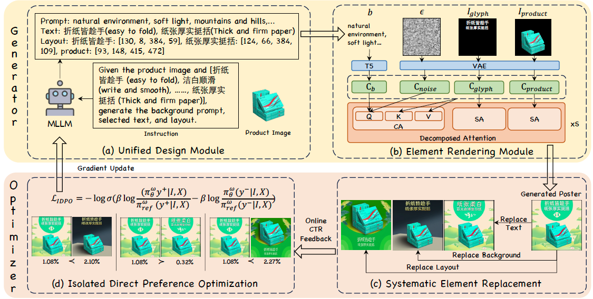

# AutoPP: Towards Automated Product Poster Generation and Optimization [AAAI 2026]

[](https://arxiv.org/abs/2512.21921)


## Abstract
Product posters blend striking visuals with informative text to highlight the product and capture customer attention. However, crafting appealing posters and manually optimizing them based on online performance is laborious and resource-consuming. To address this, we introduce AutoPP, an automated pipeline for product poster generation and optimization that eliminates the need for human intervention. Specifically, the generator, relying solely on basic product information, first uses a unified design module to integrate the three key elements of a poster (background, text, and layout) into a cohesive output. Then, an element rendering module encodes these elements into condition tokens, efficiently and controllably generating the product poster. Based on the generated poster, the optimizer enhances its Click-Through Rate (CTR) by leveraging online feedback. It systematically replaces elements to gather fine-grained CTR comparisons and utilizes Isolated Direct Preference Optimization (IDPO) to attribute CTR gains to isolated elements. Our work is supported by AutoPP1M, the largest dataset specifically designed for product poster generation and optimization, which contains one million high-quality posters and feedback collected from over one million users. Experiments demonstrate that AutoPP achieves state-of-the-art results in both offline and online settings

 

## 📢 News
`[Coming Soon]:` ✨ Training and inference code of IDPO.

`[2026-01-12]:` 🔥 We've released our product poster generation and optimization dataset.

`[2025-12-26]:` 🎯 Our paper is now available on arXiv! Check it out here: [https://arxiv.org/abs/2512.21921](https://arxiv.org/abs/2512.21921).

`[2025-11-08]:` 🎉 Exciting news! Our paper has been accepted to AAAI 2026! Stay tuned for more updates!

## 📊 Datasets
**1. Product poster generation subset**

[Download Link](https://3.cn/10UpIRm-Z)
Access password: kyxkh5

Each line of the dataset contains triplets of image URLs along with background descriptions, structured as follows:

```
<ground_truth_image_url>,<product_image_url>,<glyph_image_url>,<background_description>
```

**Note**: Append the prefix http://img30.360buyimg.com/sku/ to the download URL.

**2. Product poster optimization subset**
[Download Link](https://3.cn/-10Wxotuu)
Access password: qmlbbc

```trans_img.zip``` contains all the images required for model training. ```idpo_all_samples.json``` contains the structured training data with the following schema:

```
[
  {
    "id": "10025762562081",
    "image": "data/trans_img/10025762562081.png",
    "chosen_conversation": [{"from": "human", "value": "xxx"}, {"from": "gpt", "value": "xxx"}],
    "reject_conversation": [{"from": "human", "value": "xxx"}, {"from": "gpt", "value": "xxx"}],
  }
  ...
]
```

## Citation
If you find our paper or repo helpful for your research, please consider citing our paper and giving this repo a star⭐. Thank you! :)
```
@article{fan2025autopp,
  title={AutoPP: Towards Automated Product Poster Generation and Optimization},
  author={Fan, Jiahao and Qin, Yuxin and Feng, Wei and Chen, Yanyin and Li, Yaoyu and Ma, Ao and Li, Yixiu and Zhuang, Li and Bian, Haoyi and Zhang, Zheng and others},
  journal={arXiv preprint arXiv:2512.21921},
  year={2025}
}
```

## Copyright
The dataset and code in this project are provided by JD.COM and are intended solely for academic research purposes. Any commercial use requires explicit authorization from JD.COM. Unauthorized commercial use of any part of this project is strictly prohibited.